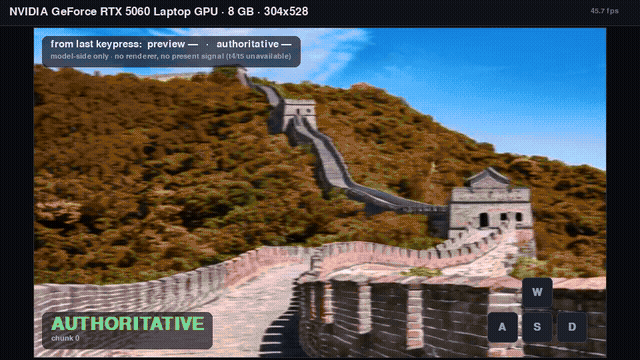

<div align="center">
  

<h1>Infinite Worlds with Versatile Interactions</h1>

Robbyant Team

</div>


<div align="center">

[](https://technology.robbyant.com/lingbot-world-v2)
[](https://arxiv.org/abs/2607.07534)
[](https://huggingface.co/collections/robbyant/lingbot-world-v2)
[](https://modelscope.cn/collections/Robbyant/LingBot-World-V2)
[](LICENSE.txt)
<video src="https://github.com/user-attachments/assets/70bf5b40-df07-4266-b7f9-d3a85d420309" width="100%" controls></video>

</div>

-----

We present **LingBot-World 2.0** (also known as **LingBot-World-Infinity**), an advanced iteration of [LingBot-World](https://technology.robbyant.com/lingbot-world) featuring four distinct upgrades.
- **Unbounded Interaction Horizon**: Our model achieves an unbounded interaction horizon while maintaining consistent output quality, benefiting from a carefully crafted causal pretraining paradigm.
- **Rapid Response Time**: Through distilling a real-time variant from the base model, our system guarantees rapid response time, sufficient to drive 720p video streams at 60 fps.
- **Highly Diverse Interactive Elements**: Compared to the previous version, this update introduces highly diverse interactive elements, comprising a broader spectrum of actions (*e.g.*, attacking, archery, spell-casting, and shooting) alongside a richer variety of text-driven events.
- **Agentic Harness**: We pioneer the integration of an agentic harness within the domain of world modeling, wherein a pilot agent is tasked with planning and executing character behaviors, while a director agent is responsible for synthesizing novel environmental elements as the scene progresses.


## 🚀 Try it now
The real-time version of LingBot-World-Infinity is available on two platforms. We thank [Reactor](https://www.reactor.inc/lingbot-world-v2) and [LingGuang](https://www.lingguang.com/support) for their support:
- **International (Web)**: Experience it on [Reactor](https://www.reactor.inc/lingbot-world-v2).
- **Domestic (Mobile)**: Experience it on [LingGuang](https://www.lingguang.com/support).

> **Note:** Reactor and LingGuang provide a convenient way to try LingBot-World-Infinity in real time. In our official setup, the model runs at full capability. To experience our official demo, join us at [WAIC 2026](https://waica2026.worldaic.com.cn/).

-----

## 🖥️ Community: Interactive LingBot-World 2.0 on RTX 5060 Laptop 8GB

> **Community runtime and deployment work — not part of the official Robbyant release.**

Run the **LingBot-World-V2-1.3B-Causal-Fast** world model interactively on a **single RTX 5060 Laptop GPU with 8 GB VRAM**, with live WASD camera control, a low-latency causal preview, and a correctness-preserving authoritative world state.

**RTX 5060 Laptop 8GB · 304×528 · zero additional training**

```
593 ms p50   arbitrary-phase causal preview
1.03 s p50   first authoritative real frame
232 ms       best observed preview
```

Measured over N=30 single-key events at randomized offsets, so the input's phase against the chunk boundary is uniform — what a real keypress actually experiences. Boundary-aligned harness measurements (favourable phase, wait for the in-flight chunk excluded) are `~231 ms` preview and `~820 ms` authority; see [Scope of the latency figures](#scope-of-the-latency-figures).

### What this adds

- **Live WASD interaction** instead of a predefined camera trajectory.
- **~231 ms causal visual feedback** through a zero-training preview path.
- **Preview and authority are separate:** speculative frames cannot commit world state or claim authoritative latency.
- A **50 ms preview → authoritative handoff** whose 60 Hz-equivalent evaluation reduced the peak correction step to about **0.25×** hard replacement. See the erratum in [`docs/RC_FROZEN.md`](docs/RC_FROZEN.md): the ratio is a property of the linear blend construction, but the absolute image-difference it was computed from is single-channel because of a reduction bug in `play.py`.
- **Single-GPU 8 GB deployment**, validated on an RTX 5060 Laptop GPU.
- Frozen `performance` (BF16) and `lowmem` (weight-only FP8) deployment presets.
- Release tooling, runtime tracing, fail-closed state commits, exactly-once control application, stale-event handling, and prewarm isolation.

### Quick start

```bash
./setup.sh
./run.sh play
./run.sh smoke
```

Windows:

```powershell
.\setup.ps1
.\run.ps1 play
```

### Scope of the latency figures

Two different conditions are measured in this work, and the headline quotes the second.

| Condition | preview | first authoritative real frame |
|---|---:|---:|
| **Boundary-aligned harness** (`play.py`, scripted source, wait for the in-flight chunk is zero for free) | ~231 ms | ~820 ms |
| **Arbitrary-phase keypress** (N=30, randomized offsets) | **593 ms p50** (p90 788) | **1033 ms p50** (p90 1269) |

The typical figure decomposes as **414 ms** waiting for the in-flight chunk + **591 ms** for the event's own chunk + ~28 ms decode. Only the second term is the event's own computation; the first is a stage the boundary-aligned number does not contain, because a scripted source that only ever fires at a chunk boundary never pays it. The best observed preview, 232 ms, is where the release's `~231 ms` lands.

### Measured interaction timeline

| Stage | RTX 5060 Laptop 8GB |
|---|---:|
| Input → runtime assignment | ~1 ms class |
| Causal preview decoded | **~231 ms** |
| Preview decoder alone | **27.2 ms p50** |
| Input → first authoritative real frame | **~820 ms p50** |
| Preview → authoritative handoff policy | **50 ms** |
| Renderer submit (`t4`) | **Unavailable** |
| Physical present (`t5`) | **Unavailable** |
| Input → physical display | **Not claimed / not measurable in this tree** |

`~231 ms` is **model-side decoded preview timing**, not physical display latency. The `~820 ms` figure is the measured input-to-first-authoritative-real-frame path in the release run. Because this tree has no renderer-submit or physical-present signal, it intentionally does **not** substitute a proxy timestamp and call it input-to-display latency.

**These two figures are boundary-aligned input.** The release run's input source is scripted and delivers each event at the top of the chunk loop, so its wait for the in-flight chunk is identically zero. A real keypress arrives at an arbitrary phase and must first let the current chunk finish, so the range a person experiences is one to two chunk periods — see the demo below, which measures exactly that.

### WASD interaction demo



WASD over the frozen runtime, recorded from the viewer's own framebuffer. Each press is one discrete control intent. **PREVIEW** appears as soon as the step-0 latent is decodable, then blends into the **AUTHORITATIVE** frame over 50 ms.

**This take is scripted, not hand-driven.** `--script` posts real `KEYDOWN`/`KEYUP` events, so they pass through the same handler, the same timestamping and the same runtime path a human's keys pass through — but the source of the press is automated. The claim this supports is "WASD interaction works and here is what it looks like", not "a person was typing". A hand-driven take would be labelled **Live keyboard WASD**.

The GIF above is the whole take, in this repo. The full-resolution h264 (`960×540`, 30 fps, 10 s) is attached to the [**demo-media** release](https://github.com/2002yy/lingbot-world-v2/releases/tag/demo-media) rather than committed — this repo's `.gitignore` excludes `*.mp4`, and GitHub's markdown sanitizer does not render an inline `<video>` player from a release asset URL either, so it is a link instead. Regenerate it with the command below if you want it locally.

From the keypress, model-side, at 304×528 bf16. **n=30**, single-key events fired at randomized offsets so the input's phase against the chunk boundary is uniform — `python demo_wasd.py --phase_n 30`:

| | p50 | p90 | best | worst |
|---|---:|---:|---:|---:|
| → preview decoded | **593 ms** | 788 ms | **232 ms** | 827 ms |
| → first authoritative real frame | **1033 ms** | 1269 ms | 643 ms | 1301 ms |
| of which: wait for the in-flight chunk | 414 ms | 597 ms | 63 ms | 641 ms |
| of which: the event's own chunk | 591 ms | 667 ms | 553 ms | 683 ms |

The decomposition is the point. That first row is the term the boundary-aligned release figures get to set to zero for free, and it is not noise: it is bounded by the chunk period (63–641 ms observed against a ~650 ms chunk), because an intent arriving just before a boundary waits almost nothing and one arriving just after waits for most of a chunk.

Note what the "best" column is: **232 ms to preview is the release's ~231 ms.** That figure is real, it is simply the favourable end of the phase distribution rather than the typical one. The p50 is 593 ms.

This is also where any future latency work has to aim. Faster kernels shrink both the in-flight wait and the event's own chunk; only making the in-flight chunk interruptible can remove most of the first term — and that is a different, harder problem than an early-exit, because the runtime's queue/frontier semantics deliberately claim a new input to the *next* chunk.

```bash
python demo_wasd.py                                    # live, windowed
python demo_wasd.py --mock                             # CPU-only smoke, no GPU
python demo_wasd.py --script --headless --seconds 10 \
  --record docs/demo/rtx5060_wasd_demo.mp4 --record_fps 30   # the take above
```

The recorded take uses `--script`, which posts real KEYDOWN/KEYUP events through the same handler a human's keys go through — only the source of the press is automated. Run without `--script` for live play. See [docs/DEMO_1_WASD_VIEWER.md](docs/DEMO_1_WASD_VIEWER.md) for the acceptance checks and the three defects found while building it.

### Interactive preemption

Interactive preemption policy v1 is **enabled by default** for the interactive runtime. Pass `--no-preempt` to turn it off.

Policy v1:

- preempts only for a changed control intent;
- may preempt only after the first forward boundary;
- allows at most one rebase per chunk;
- preserves the no-preemption generation trajectory when no preemption occurs;
- does not use cooldown, debounce, or predicted-benefit heuristics.

On RTX 5060 Laptop 8GB at 304×528 using the BF16 performance preset, interleaved A/B measurements produced:

| Input workload | Baseline p50 | Preemption p50 | Delta | Forward waste |
|---|---:|---:|---:|---:|
| Normal WASD | 956 ms | 709 ms | **−247 ms (−26%)** | 3.8–6.4% |
| Hold / repeated-state stress | 849 ms | 858 ms | **+9 ms — effectively neutral** | 0–0.7% |
| Rapid 200 ms direction changes | 892 ms | 886 ms | **−6 ms — effectively neutral** | 20–23% |

The primary product result is therefore **not** that preemption always reduces latency.

Under a **normal WASD workload** it reduced median input-to-first-real-frame latency by approximately 247 ms, while stable/hold input showed essentially no effect. Under an intentionally aggressive 200 ms direction-change workload, latency was approximately unchanged while redundant generation work increased substantially.

Real keyboard hold behavior is less aggressive than the synthetic hold workload: OS/key-repeat events are suppressed upstream, and a 20-second qualification run admitted only the actual direction changes, producing 2 preemptions across 35 chunks with approximately 1.4% wasted work.

Measurements used interleaved A/B arms with fixed VRAM-cleanliness and thermal-pairing gates. Earlier sequential hold/rapid measurements were rejected because GPU thermal drift was large enough to dominate the apparent effect.

Latency terminology is deliberately bounded:

- `input → first real frame` is measured;
- `input → renderer submit` is measured on the windowed viewer path;
- physical display presentation completion is **not measured**;
- renderer submit must not be reported as physical present latency.

These measurements qualify policy v1 as the default interactive policy for the tested RTX 5060 Laptop 8GB / 304×528 / BF16 configuration. They are **not** yet a claim of identical gains across other GPUs, geometries, presets, seeds, or input distributions.

### Presets

| preset | weights | peak reserved | min free | role |
|---|---|---:|---:|---|
| `performance` | BF16 | ~7104 MiB | ~821 MiB | lowest validated latency |
| `lowmem` | weight-only FP8 | ~5846 MiB | ~1161 MiB | lower VRAM, slower |

Low memory is **not** a speed mode on this GPU: the FP8 weight-only path trades capacity for speed.

### Why the preview is not allowed to become authority

LingBot-World is autoregressive. A small numerical change written into persistent state can compound into a different long-horizon world trajectory. This runtime therefore keeps two concepts separate:

- **Preview:** early decoded feedback; never commits persistent world state.
- **Authoritative frame:** produced by the frozen full path and allowed to advance persistent state only after a fail-closed commit.

Reduced fixed-step authoritative paths were tested and rejected because state divergence increased across subsequent chunks. Short-run backend similarity was also insufficient: long-horizon tests showed that approximate attention/backend changes can drift into a different world trajectory even when single-call similarity is very high.

### Frozen release boundary

The release candidate preserves rejected experiments as part of the engineering record instead of silently reopening them:

- fixed 2-step / 1-step authoritative generation — cumulative state/KV divergence;
- learned preview head — capacity and cross-scene generalization failure;
- same-GPU asynchronous preview — no useful overlap;
- latent-downsample preview — severe quality loss;
- approximate attention/backend changes as the authoritative default — long-horizon trajectory divergence;
- exact-path KV shortcutting — the clean state-write is effectively another full model forward, not a memcpy problem.

**Deployment geometry note.** The upstream nominal geometry and this 8 GB deployment geometry are different authorities. All measurements in this community work refer to **304×528** unless explicitly stated otherwise.

Full documentation:
[`README_RELEASE.md`](README_RELEASE.md) ·
[`docs/BENCHMARK_CARD.md`](docs/BENCHMARK_CARD.md) ·
[`docs/RELEASE_1_AUTHORITY.md`](docs/RELEASE_1_AUTHORITY.md) ·
[`docs/RC_FROZEN.md`](docs/RC_FROZEN.md)

-----

## 🎬 Demo Gallery

### LingBot-World-V2-14B-Causal-Pretrain

<div align="center">
  <video src="https://github.com/user-attachments/assets/f6b65106-e791-4da5-836e-b2214e2dc721" width="100%" controls></video>
  <video src="https://github.com/user-attachments/assets/d06f61a3-6c20-4718-995f-e9223e9217d5" width="100%" controls></video>
</div>

### LingBot-World-V2-14B-Causal-Fast

<div align="center">
  <video src="https://github.com/user-attachments/assets/f1059674-a7e7-45b1-8738-627d811d7bee" width="100%" controls></video>
  <video src="https://github.com/user-attachments/assets/538097aa-6c02-48e1-9802-563416f6191a" width="100%" controls></video>
  <video src="https://github.com/user-attachments/assets/ab2a81a8-56f7-4328-a5cc-80477151c61c" width="100%" controls></video>
  <video src="https://github.com/user-attachments/assets/2a1a4864-7809-4bff-ab08-32bd30099581" width="100%" controls></video>
  <video src="https://github.com/user-attachments/assets/e7e0749a-9ca9-4502-a846-661c41b48096" width="100%" controls></video>
  <video src="https://github.com/user-attachments/assets/09970b6c-990d-4e40-bd8b-82755400fa9d" width="100%" controls></video>
</div>

### LingBot-World-V2-1.3B-Causal-Fast

<div align="center">
  <video src="https://github.com/user-attachments/assets/ad7929f0-58e1-4956-91db-f7a5e14e3d81" width="100%" controls></video>
</div>

<p align="center"><i>✨ For more high-fidelity and compelling demos, please visit our <a href="https://technology.robbyant.com/lingbot-world-v2">Project Page</a>.</i></p>

## 🔥 News
- Sep. 10, 2026: 🎉 We release the remaining full model variants: the 14B model’s causal-pretrained and bidirectional variants, and the 1.3B model’s causal-fast variant.
- Jul. 9, 2026: 🎉 We release the technical report, inference code, and models for LingBot-World-Infinity.

## 📋 TODO
- [x] Release the causal-fast inference code and model of the 14B model
- [x] Release the causal-pretrained model of the 14B model
- [x] Release the bidirectional model of the 14B model
- [x] Release the causal-fast model of the 1.3B model

## ⚙️ Quick Start
This codebase is built upon [Wan2.2](https://github.com/Wan-Video/Wan2.2). Please refer to their documentation for installation instructions.
### Installation
Clone the repo:
```sh
git clone https://github.com/robbyant/lingbot-world-v2.git
cd lingbot-world-v2
```
Install dependencies:
```sh
# Ensure torch >= 2.4.0
pip install -r requirements.txt
```
Install [`flash_attn`](https://github.com/Dao-AILab/flash-attention):
```sh
pip install flash-attn --no-build-isolation
```
### Model Download

| Model | Model Type | Model Size | Download Links |
| :---  | :--- | :--- | :--- |
| **lingbot-world-v2-14b-causal-fast** | causal-fast | 14B | 🤗 [HuggingFace](https://huggingface.co/robbyant/lingbot-world-v2-14b-causal-fast) 🤖 [ModelScope](https://www.modelscope.cn/models/Robbyant/lingbot-world-v2-14b-causal-fast) |
| **lingbot-world-v2-14b-causal-pretrain** | causal-pretrain | 14B | 🤗 [HuggingFace](https://huggingface.co/robbyant/lingbot-world-v2-14b-causal-pretrain) |
| **lingbot-world-v2-14b-bid** | bidirectional | 14B | 🤗 [HuggingFace](https://huggingface.co/robbyant/lingbot-world-v2-14b-bid) |
| **lingbot-world-v2-1.3b-causal-fast** | causal-fast | 1.3B | 🤗 [HuggingFace](https://huggingface.co/robbyant/lingbot-world-v2-1.3b-causal-fast) |


Download models using huggingface-cli:
```sh
pip install "huggingface_hub[cli]"
huggingface-cli download robbyant/lingbot-world-v2-14b-causal-fast --local-dir ./lingbot-world-v2-14b-causal-fast
huggingface-cli download robbyant/lingbot-world-v2-1.3b-causal-fast --local-dir ./lingbot-world-v2-1.3b-causal-fast/transformers
```
Download models using modelscope-cli:
 ```sh
pip install modelscope
modelscope download robbyant/lingbot-world-v2-14b-causal-fast --local_dir ./lingbot-world-v2-14b-causal-fast
```

The 1.3B Hugging Face package currently contains the DiT weights only. T5, VAE, and the tokenizer are shared with the 14B release — pass them with `--assets_dir` (or the third argument of `run_fast.sh`):


### Inference

We provide `generate.py` for causal inference with KV caching, which processes video frames chunk-by-chunk instead of all at once.
<!-- The `--infer_mode` flag selects the inference mode:

| infer_mode | Model | Sampling |
| :--- | :--- | :--- |
| `causal_fast` (default) | Distilled few-step model (`LingBot-World-Fast`) | 4 steps per chunk, no CFG |
| `causal_pretrain` | Pretrained causal model | 40 steps per chunk with CFG | -->

- `causal_fast` 14B — 480P, 8 GPUs (`ulysses_size` must divide 40 heads):
  ``` sh
  torchrun --nproc_per_node=8 generate.py --task i2v-A14B --size 480*832 --ckpt_dir lingbot-world-v2-14b-causal-fast --image examples/03/image.jpg --action_path examples/03 --dit_fsdp --t5_fsdp --ulysses_size 8 --frame_num 361 --local_attn_size 18 --sink_size 6 --prompt "A serene lakeside scene with a lone tree standing in calm water, surrounded by distant snow-capped mountains under a bright blue sky with drifting white clouds — gentle ripples reflect the tree and sky, creating a tranquil, meditative atmosphere."
  ```

- `causal_fast` 1.3B — 480P, 4 GPUs (`ulysses_size` must divide 12 heads). Reuse T5/VAE from the 14B checkpoint if the 1.3B folder does not include them:
  ``` sh
  torchrun --nproc_per_node=4 generate.py --task i2v-1.3B --size 480*832 --ckpt_dir lingbot-world-v2-1.3b-causal-fast --assets_dir lingbot-world-v2-14b-causal-fast --image examples/03/image.jpg --action_path examples/03 --dit_fsdp --t5_fsdp --ulysses_size 4 --frame_num 361 --local_attn_size 18 --sink_size 6 --prompt "A serene lakeside scene with a lone tree standing in calm water, surrounded by distant snow-capped mountains under a bright blue sky with drifting white clouds — gentle ripples reflect the tree and sky, creating a tranquil, meditative atmosphere."
  ```

- `causal_pretrain` — 480P, multi-GPU:
  ``` sh
  torchrun --nproc_per_node=8 generate.py --task i2v-A14B --infer_mode causal_pretrain --size 480*832 --ckpt_dir lingbot-world-v2-14b-causal-pretrain --image examples/03/image.jpg --action_path examples/03 --dit_fsdp --t5_fsdp --ulysses_size 8 --frame_num 81 --prompt "A serene lakeside scene with a lone tree standing in calm water, surrounded by distant snow-capped mountains under a bright blue sky with drifting white clouds — gentle ripples reflect the tree and sky, creating a tranquil, meditative atmosphere."
  ```

You can also use the provided `run_fast.sh` script. The task and GPU count are inferred from the checkpoint directory name (`*1.3b*` / `*1p3b*` → 1.3B on 4 GPUs, otherwise 14B on 8 GPUs):
``` sh
bash run_fast.sh <weights_dir> <frame_num> [assets_dir]
# e.g. bash run_fast.sh lingbot-world-v2-14b-causal-fast 361
# e.g. bash run_fast.sh lingbot-world-v2-1.3b-causal-fast 361 lingbot-world-v2-14b-causal-fast
```

### Deployment
We do NOT plan to release our deployment code. If you would like to deploy our model yourself, please refer to the LingBot-World deployment in [SGLang](https://docs.sglang.io/cookbook/diffusion/LingBot-World/LingBot-World-2.0) or [flashdreams](https://github.com/NVIDIA/flashdreams).

## 📚 Related Projects
- [LingBot-World](https://github.com/robbyant/lingbot-world)

## 📜 License
This project is licensed under the Creative Commons Attribution-NonCommercial-ShareAlike 4.0 International License (CC BY-NC-SA 4.0). The project is available for non-commercial use only: you may share and adapt it with proper attribution, but derivative works must be distributed under the same license. Please refer to the [LICENSE file](LICENSE.txt) for the full text, including details on rights and restrictions.

## ✨ Acknowledgement
We would like to express our gratitude to the Wan Team for open-sourcing their code and models. Their contributions have been instrumental to the development of this project.

## 📖 Citation
If you find this work useful for your research, please cite our paper:

```
@article{lingbot-world-v2,
      title={Infinite Worlds with Versatile Interactions}, 
      author={Zelin Gao and Qiuyu Wang and Jiapeng Zhu and Jingye Chen and Zichen Liu and Qingyan Bai and Jiahao Wang and Yufeng Yuan and Hanlin Wang and Yichong Lu and Ka Leong Cheng and Haojie Zhang and Jian Gao and Tianrui Feng and Yuzheng Liu and Yao Yao and Yinghao Xu and Xing Zhu and Yujun Shen and Hao Ouyang},
      journal={arXiv preprint arXiv:2607.07534},
      year={2026}
}
```
